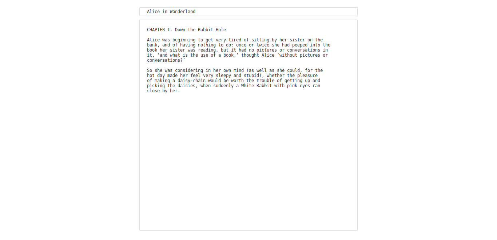

# monograph

A little in-browser note taking appliaction focused on simlicity and privacy.  
Your data never leaves your computer: no cloud storage, no browser extension.

**Link to publicly hosted copy:** http://averyn.scripts.mit.edu/monograph/

This project is basically just a glorified textbox. I'm sharing it here
not because it's particularly inventive in and of itself, but because I've
found that it fits nicely into my workflow, and I though that others might
find it useful as well.

**How I use this little editor:**

I use this application (if you can even call it that),
for taking notes as I work throughout the day. I've used
other note-taking tools in the past, but lately I've been trying to minimize
the amount of data I store in the cloud. I could always use sublime or another
text editor for taking notes, but I wanted something that I could use from my 
browser without installing any additional software.

The application uses the following 5 lines of Javascript:
```js
titleInput = document.getElementById('titleInput');
titleInput.addEventListener("input", function (e) {
    title = titleInput.value;
    document.title = title != "" ? title : "untitled";
});
```
which updates the title of the page when the title of the note changes.
When I want to save my note, I just save the whole page using `ctrl-s`,
to a "notes" directory on my desktop: a note titled "myNote" gets saved
as `myNote.html`. Firefox also saves the contents of the textbox in the saved 
page-source. That way, when I want to view or edit my note, I can just open
up `~/Desktop/notes/myNote.html` in my browser, and overwrite the saved file
if I make any changes. 

I find myself using this application pretty often - it works well for jotting 
down ideas, in part because it feels even more "lightweight" than making a new 
Google Doc or firing up a text editor - it feels like the computer equivalent of
scratch-paper. And, best of all, my data never leaves my computer!

**Screenshot:**


